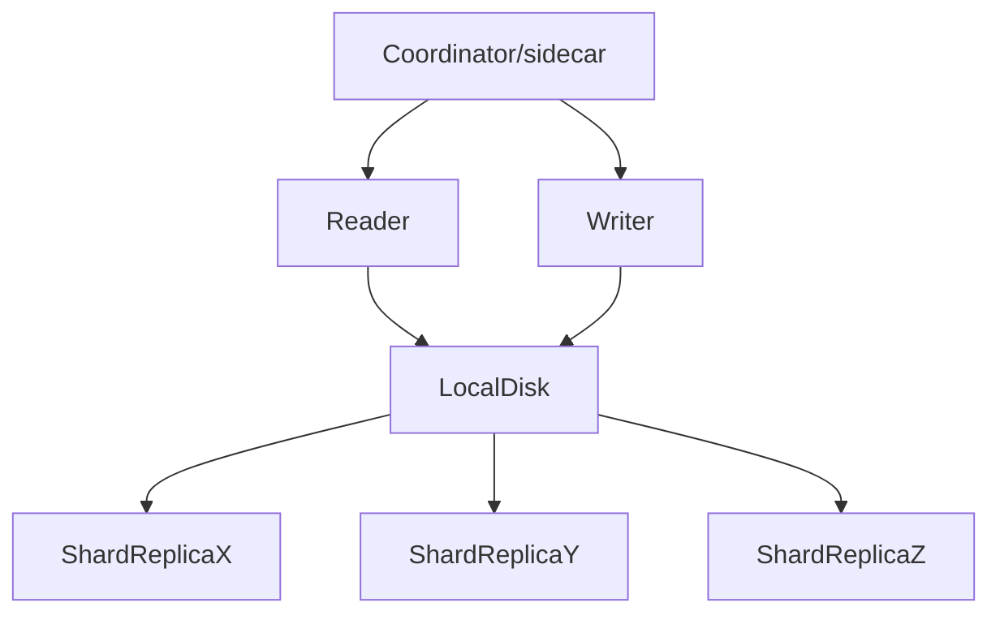
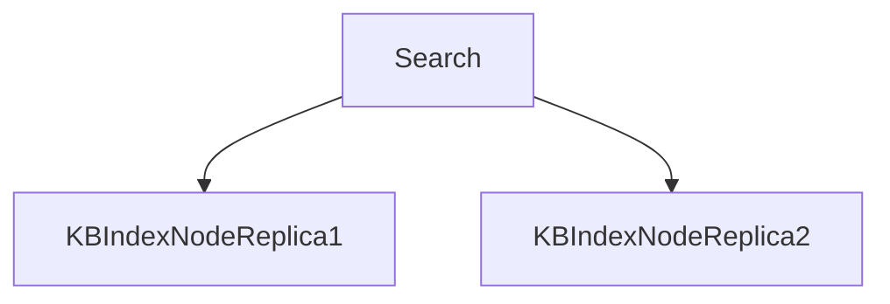
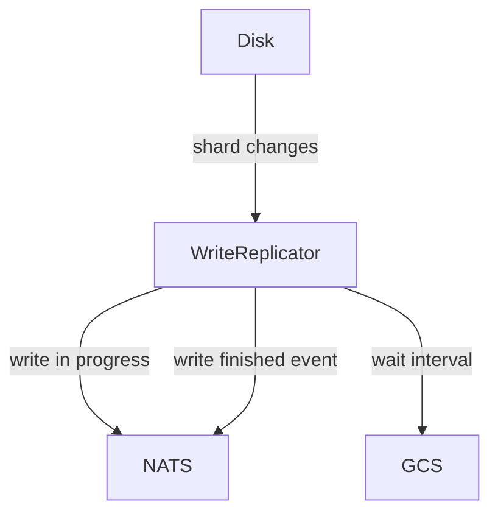
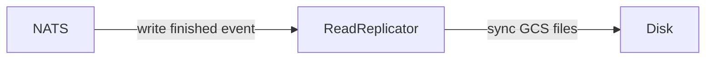
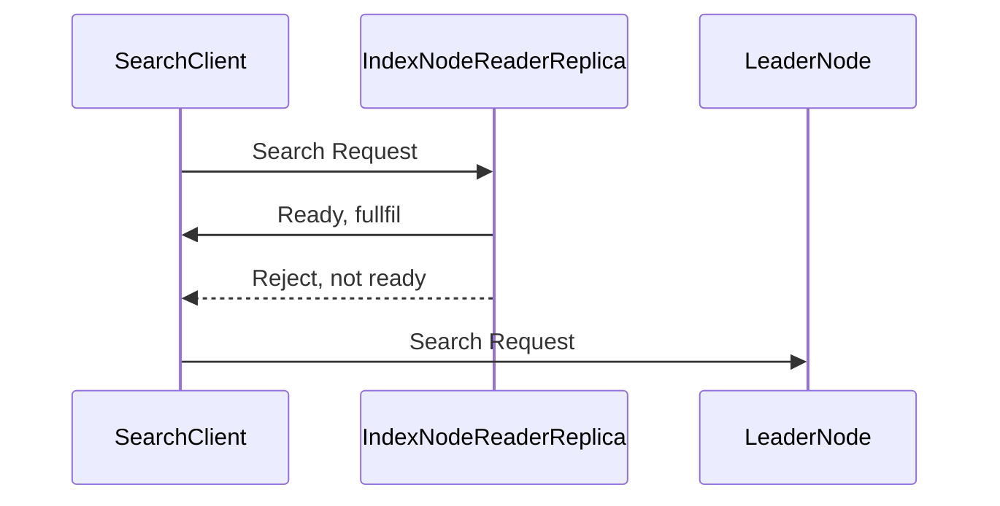

# Index Scaling: Decoupling disk, reads/writes 

This proposal focuses on decoupling shard disk storage from the IndexNodes
they are being written to and also enables scaling reads separately from writes.

It primarily accomplishes this by using a replicated shared write storage layer and allowing
read replicas of the file storage layer to enable decoupled ownership of shard data. This enables\
scaling index read replicas separately from writes.

*Goals*:
- Allow short term scaling needs of IndexNode and search requests
- Allow to scale reads separately from writes without rebalancing churn
- Minimize impact of strategy on existing design to validate strategy without too much refactoring churn

*Assumptions*:
- Reads/writes should be scaled separately
- (We will read much more than we will write). Is this true?
- Reindexing to produce new replicas is not tenable

*Unknowns*
- Long term NucliaDB normal "usage"
- How pricing changes over time affects usage

## Definitions

- Shard: the storage of a knowledge box's indexes(keyword, bm25, graph, vector).
  We currently store multiple replicas of a knowledge box's indexes
  across different nodes.
- Node: Storage, writer, reader and node coordinator(sidecar) for a set of shards that
  contain index data. This is separate from resource data.
- IndexNode: For the purpose of this proposal and to prevent confusion around naming,
  a node will be called `IndexNode`
- IndexNodeReaderReplica: Different from shard replica, this refers to a deployment replica
  that will contained a copy of index data for many shards.

## Current solution/situation

Currently, an IndexNode is deployed for writes(indexing) and reads(searching) for a set
of shards. Each shard is replicated and read(search) requests are typically
round robin load balanced against the IndexNodes that hold replicas.

Scaling this design requires the following:
- scale disk: spread shards across more IndexNodes
- scale disk: physically copy/move shards around between IndexNodes to rebalance
- scale write CPU: spread shards out and move shards around between IndexNodes to balance
- scale read CPU: increase shard replicas

The persistent storage for our IndexNode data is on a local disk owned by the IndexNode so
scaling would involve a lot of moving data around and then locking of data
while sychronization was happening.

Node design:

Each indexing operation happens on each shard replica a resource is on

Finally, search requests are round robin load balanced against the IndexNodes a knowledge box
shard replicas are located on(2 shard replicas typically):

## Proposed Solution

This proposal focuses on an implementation that will cause minimal impact on the existing
architecture and allows us to test/gather feedback on feasability quickly.

### Storage replication

Every write to a shard's data files should also be written to GCS(Google Cloud Storage).

A IndexNode's local disk is the primary write location; however, these data
files will also be copied to GCS on a configurable interval.

#### Write replication:

On an IndexNode, in phase 1, use file system events to detect changes and manage
synchonizing data to write storage, writes will be synchronized to GCS.

#### Read storage replication:

Read replicas then consume write finished events from NATS and use that
to know when to sync changes from GCS.

`write in progress` events notify the IndexNodeReaderReplica that the current shard it maintains is stale

### IndexNodeReaderReplica

To start off, this proposal suggests we implement IndexNodeReaderReplicas with a
stateless architecture consistent hashing keyring distribution.

Benefits:
- short term, we can implement this architecture with minimal changes to existing system so
  it allows us to test the new system without impact on existing system
- no cluster state needed to communciate for reader replicas

Drawbacks:
- CPU distribution will likely be uneven; however, as we manage more data,
  it is possible this will even out

### Search readiness

Since there is a lag between when an index is written to and when the data is repliced
and available in a IndexNodeReaderReplica, a IndexNodeReaderReplica will maintain state on the
readiness of each shard. If a write is in progress, the shard will be considered not ready
and the IndexNodeReaderReplica can reject the request. In this scenario, the client will
retry the search requests to the leader IndexNode that has the source of truth for index data.

Tunable parameters:
- shard replicas: number of nodes a shard should be repliced on
- deployment size: number of IndexNodeReaderReplica, this determines keyring size.
  Should be odd number like 1, 3 or 5, etc.

Example 1:
- shard replica count: 3
- deployment size: 10
- shard id lands on replica 10
- available readers: 9, 10, 1

Example 2:
- shard replica count: 5
- deployment size: 20
- shard id lands on replica 1
- available readers: 1, 2, 3, 19, 20

### Rebalance writes

We still have the problem where a single node is having difficulty keeping up with the
amount of writes going to it and we need to rebalance the shards it is managing.

> :warning: Keep in mind, writes are handled in a single, sequential stream on the
  IndexNode so if writes are falling behind, it is because we have too active of shards
  on a single IndexNode, not necessarily that nodes are too large. In this scenario, write
  scaling is more about CPU and write speed on a single pipe. WE CAN ADJUST HOW THIS SCALES AS WELL.

In the scenario where a data shards needs to be moved to be owned by different IndexNode, the
sequencing is the following:

1. Lock shard: forward all indexing messages to shard mover stream
2. Sync shard data from GCS
3. Consume messages from shard mover stream
4. Change shard node pointer to new node
5. Delete old shard data

## Rollout plan

### Phase 1: Storage replication and search scaling

Phase 1 will focus on an approach with limited impact on the existing implementation.

Writer disk changes will be detected by file system events, md5 checks and disk scanning.

IndexNodeReaderReplicas will be managed through stateless consistent hashing and round robin
search requests against readers.

Validate metrics.

### Phase 2: Shard rebalancing, remove replicas

After phase 1 is validated, phase 2 will focus on being able to scale writes
and removing the usage of having more than 1 replica. Since data is already
being synchronized to GCS, there will no longer be any need to manage
replicas at this layer.

### Phase 3: Re-evaluate reader consistent hasing sharding strategy

Evaluate how even of CPU usage distribution is achieved by consistent hashing
of IndexNodeReaderReplicas.

If other phases complete, move on to state managemet of IndexNodeReaderReplicas to manage shard load balancing.

## Key metrics

- Disk write replication latency: how long are disk writes taking to replicate to readers?
- Search replica not ready count: how often are search requests getting directed to a read replica when it is not ready
- Write lag latency: How often are writes delayed

## Success Criteria

- No downtime rollout and validation
- Dashboards/alarms implemented
- Limited touch scale management
- Key metrics under control
