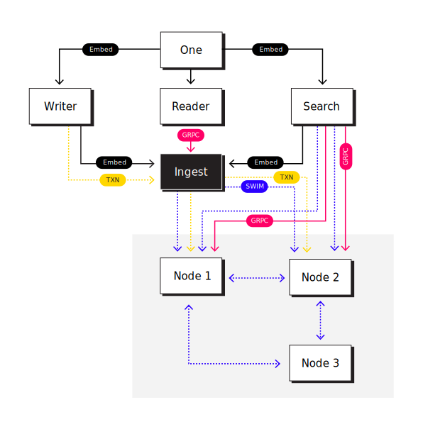

  

<h3 align="center">The database for data scientists and machine learning engineers working with HuggingFace and other data pipelines</h3>

<h4 align="center">
  <a href="docs/getting-started/quickstart.md">Quickstart</a> |
  <a href="docs/">Docs</a> |
  <a href="docs/tutorials">Tutorials</a> |
  <a href="https://discord.gg/AgevjFJUvk">Chat</a>
</h4>

### Check out our [blog post](https://nuclia.com/building-nuclia/first-release/) to grasp what we have been doing for the last months.

As a data scientist or NLP person your hard-drive is probably full of datasets and corpora. So, if you have found yourself crashing a notebook trying to load something too big with Pandas, doing way too many shuffles in your shell just to explore your data a bit, or just not really knowing how to perform a better search through your dataset, this is a tool for you.

NucliaDB is written in Rust and Python and built on top of the mighty [tantivy](https://github.com/quickwit-oss/tantivy) library. We designed it to index big datasets and provide multi-teanant suport.

## Component code coverage

|Module|Coverage|
|------|--------|
|search||
|reader||
|writer||
|ingest||
|one||
|sidecar||
|utils||

# Features
- Compare the vectors from different models in a super easy way.
- Store text, files and vectors, labels and annotations.
- Access and modify your resources efficiently.
- Annotate your resources.
- Perform text searches, given a word or set of words, return resources in our database that contain them.
- Perform semantic searches with vectors, that is, given a set of vectors return the closest matches in our database. In an NLP use case, this allows us to look for similar sentences without being constrained by exact keywords
- Export your data in a format compatible with most NLP pipelines (HuggingFace datasets, pytorch, etc)
- Store original data, extracting and understanding data on object and blob storage
- Index fields, paragraphs, and semantic sentences on index storage
- Cloud extraction and understanding with Nuclia Understanding API™
- Cloud connection to train ML models with Nuclia Learning API™
- Container security based with Reader, Manager, Writer Roles
- Resources with multiple fields and metadata
- Text/HTML/Markdown plain fields support
- File field support with direct upload and TUS upload
- Link field support
- Conversation field support
- Blocks/Layout field support
- Eventual consistency transactions based on Nats.io
- Distributed source of truth with TiKV and Redis support
- Blob support with S3-compatible API and GCS
- Replication of index storage
- Distributed search
- Cloud-native: Kubernetes only

## Upcomming Features

- Blob support with Azure Blob storage
- Index relations on index storage

## Architecture

  

## Quickstart

Trying NucliaDB is super easy! You can extend your knowledge with the
following readings:

- [Run NucliaDB with docker with a single command!](docs/getting-started/quickstart.md)
- Join forces with Nuclia to run [NucliaDB with unlimited power](docs/getting-started/limitless-nucliadb-with-nuclia.md)
- We use own concepts as Knowledge Box in NucliaDB, so ensure you read about [our basic concepts](docs/getting-started/basic-concepts.md)
- Further dive into our [tutorials](docs/tutorials),
  [reference](docs/reference) or [internal](docs/internal) documentation

## API Tutorials

- [Upload a file](https://docs.nuclia.dev/docs/quick-start/push)

# 💬 Community

- Chat with us in [Discord][discord]
- 📝 [Blog Posts][blogs]
- Follow us on [Twitter][twitter]
- Do you want to [work with us][linkedin]?

# 🙋 FAQ

## How is NucliaDB different from traditional search engines like Elasticsearch or Solr?

The core difference and advantage of NucliaDB is its architecture built from the ground up for cloud and unstructured data. Its vector index plus standard keyword and fuzzy search provide an API to use all extracted and learned information from Nuclia, understanding API and provide super NLP powers to any application with low code and peace of mind.

## What license does NucliaDB use?

NucliaDB is open-source under the GNU Affero General Public License Version 3 - AGPLv3. Fundamentally, this means that you are free to use NucliaDB for your project, as long as you don't modify NucliaDB. If you do, you have to make the modifications public.

## What is Nuclia's business model?

Our business model relies on our normalization API, this one is based on `Nuclia Learning API` and `Nuclia Understanding API`. This two APIs offers transformation of unstructured data to NucliaDB compatible data with AI. We also offer NucliaDB as a service at our multi-cloud provider infrastructure: [https://nuclia.cloud](https://nuclia.cloud).

# 🤝 Contribute and spread the word

We are always super happy to have contributions: code, documentation, issues, feedback, or even saying hello on discord! Here is how you can get started:

- Have a look through GitHub issues labeled "Good first issue".
- Read our [Contributor Covenant Code of Conduct](CODE_OF_CONDUCT.md)
- Create a fork of NucliaDB and submit your pull request!

✨ And to thank you for your contributions, claim your swag by emailing us at info at nuclia.com.

## Reference

- [Nuclia Documentation](https://docs.nuclia.dev/)
- [API Reference](https://docs.nuclia.dev/docs/api)
- [NucliaDB internal documentation](docs/internal/)

## Meta

- [Rust Code Style](CODE_STYLE_RUST.md)
- [Python Code Style](CODE_STYLE_PYTHON.md)
- [Code of conduct](CODE_OF_CONDUCT.md)
- [Contributing](CONTRIBUTING.md)

[website]: https://nuclia.com/
[cloud]: https://nuclia.cloud/
[twitter]: https://twitter.com/nucliaAI
[discord]: https://discord.gg/AgevjFJUvk
[blogs]: https://nuclia.com/blog
[linkedin]: https://www.linkedin.com/company/nuclia/

