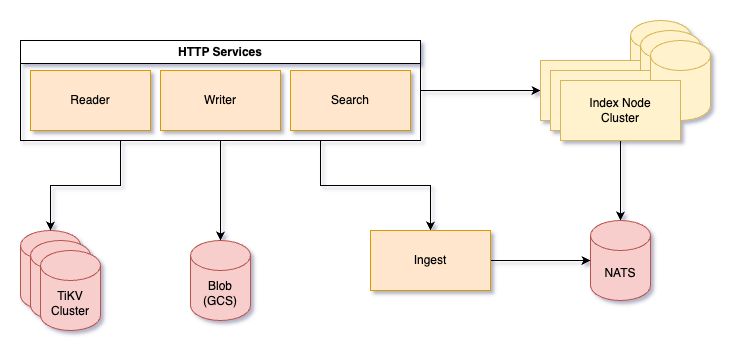

  

<h3 align="center">The AI Search Database.</h3>

<h4 align="center">
  <a href="https://docs.nuclia.dev/docs/docs/nucliadb/intro">DB Quickstart</a> |
  <a href="https://docs.nuclia.dev/docs/about/nuclia">Nuclia Docs</a> |
  <a href="docs/">NucliaDB Developer docs</a> |
  <a href="https://discord.gg/AgevjFJUvk">Chat</a>
</h4>

NucliaDB is a robust database that allows storing and searching on
unstructured data.

It is an out of the box hybrid search database, utilizing vector,
full text and graph indexes.

NucliaDB is written in Rust and Python. We designed it to index large datasets and provide multi-teanant suport.

When utilizing NucliaDB with Nuclia cloud, you are able to the power
of an NLP database without the hassle of data extraction, enrichment
and inference. We do all the hard work for you.

# Features
- Store text, files, vectors, labels and annotations
- Perform text searches and given a word or set of words, return resources in our database that contain them.
- Perform semantic searches with vectors. For example, given a set of vectors, return the closest matches in our database. With NLP, this allows us to look for similar sentences without being constrained by exact keywords.
- Export your data in a format compatible with most NLP pipelines (HuggingFace datasets, pytorch, etc)
- Store original data, extracting and data pulled from the Understanding API
- Index fields, paragraphs, and semantic sentences on index storage
- Cloud data and insight extraction with the Nuclia Understanding API™
- Cloud connection to train ML models with Nuclia Learning API™
- Role based security system with upstream proxy authentication validation
- Resources with multiple fields and metadata
- Text/HTML/Markdown plain fields support
- Field types: text, file, link, conversation, layout
- Storage layer support: TiKV, Redis and PostgreSQL
- Blob support with S3-compatible API, GCS and PG drivers
- Replication of index storage
- Distributed search
- Cloud-native

## Architecture

  

## Quickstart

Trying NucliaDB is super easy! You can extend your knowledge with the
following readings:

- [Quick start!](https://docs.nuclia.dev/docs/docs/nucliadb/intro)
- Read about what Knowledge boxes are in [our basic concepts](https://docs.nuclia.dev/docs/docs/nucliadb/basics) section
- [Upload a file](https://docs.nuclia.dev/docs/docs/getting-started/quick-start/push)

# 💬 Community

- Chat with us in [Discord][discord]
- 📝 [Blog Posts][blogs]
- Follow us on [Twitter][twitter]
- Do you want to [work with us][linkedin]?

# 🙋 FAQ

## How is NucliaDB different from traditional search engines like Elasticsearch or Solr?

The core difference and advantage of NucliaDB is its architecture built from the ground up for unstructured data. Its vector index, keyword, graph and fuzzy search provide an API to use all extracted and extracted information from Nuclia, Understanding API and provides powerful NLP abilities to any application with low code and peace of mind.

## What license does NucliaDB use?

NucliaDB is open-source under the GNU Affero General Public License Version 3 - AGPLv3. Fundamentally, this means that you are free to use NucliaDB for your project, as long as you don't modify NucliaDB. If you do, you have to make the modifications public.

## What is Nuclia's business model?

Our business model relies on our normalization API, this one is based on `Nuclia Learning API` and `Nuclia Understanding API`. This two APIs offers transformation of unstructured data to NucliaDB compatible data with AI. We also offer NucliaDB as a service at our multi-cloud provider infrastructure: [https://nuclia.cloud](https://nuclia.cloud).

# 🤝 Contribute and spread the word

We are always happy to have contributions: code, documentation, issues, feedback, or even saying hello on discord! Here is how you can get started:

- Read our [Contributor Covenant Code of Conduct](CODE_OF_CONDUCT.md)
- Create a fork of NucliaDB and submit your pull request!

✨ And to thank you for your contributions, claim your swag by emailing us at info at nuclia.com.

## Reference

- [Nuclia Documentation](https://docs.nuclia.dev/)
- [API Reference](https://docs.nuclia.dev/docs/api)

## Meta

- [Rust Code Style](CODE_STYLE_RUST.md)
- [Python Code Style](CODE_STYLE_PYTHON.md)
- [Code of conduct](CODE_OF_CONDUCT.md)
- [Contributing](CONTRIBUTING.md)

[website]: https://nuclia.com/
[cloud]: https://nuclia.cloud/
[twitter]: https://twitter.com/nucliaAI
[discord]: https://discord.gg/AgevjFJUvk
[blogs]: https://nuclia.com/blog
[linkedin]: https://www.linkedin.com/company/nuclia/
