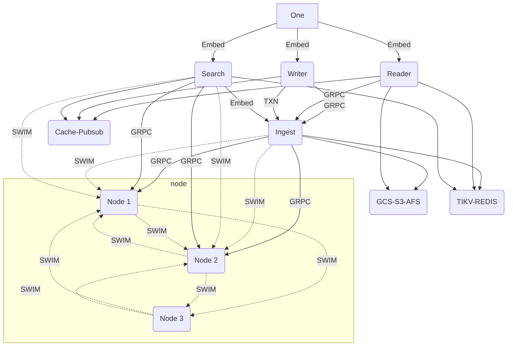

# Components

```mermaid
graph TD
    O[One] -->|Embed| W(Writer)
    O -->|Embed| R(Reader)
    O -->|Embed| S(Search)
    W -->|GRPC| I(Ingest)
    R -->|GRPC| I
    W -->|TXN| I
    S -->|Embed| I
    I -->|GRPC| N1(Node 1)
    S -->|GRPC| N1
    I -->|GRPC| N2(Node 2)
    I -.->|SWIM| N1
    I -.->|SWIM| N2
    S -.->|SWIM| N1
    S -.->|SWIM| N2
    S -->|GRPC| N2
    I --> G(GCS-S3-AFS)
    R --> G
    I --> T(TIKV-REDIS)
    R --> T
    S --> T
    R --> C(Cache-Pubsub)
    W --> C
    S --> C
    subgraph node
    N1 -.->|SWIM| N2
    N2 -.->|SWIM| N1
    N3 -.->|SWIM| N1
    N1 -.->|SWIM| N3(Node 3)
    N3 -.->|SWIM| N2
    N2 -.->|SWIM| N3
    end
```
