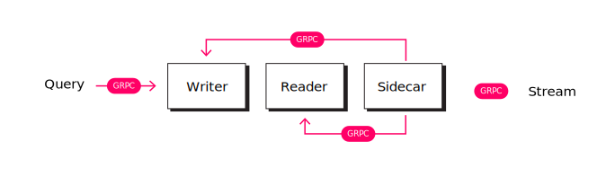

# NODE

Nodes are the underlying index that fullfills a GRPC API to deliver indexing on Text, Vectors and Relations.

## Architecture

Each node is composed by multiple shards and each shard have four indexes. In order to prioritize reads we split each node on three containers: reader, writer and sidecar.

Reader is responsible of search functionallity via a GRPC interface, Writer is responsible on writing via a GRPC interface and Sidecar connects to a stream of indexing information and injects information on the writer.

  

## Indexes

### BM25 Field Search

Developed on top of [tantivy](https://github.com/quickwit-oss/tantivy) term query search

### Fuzzy Paragraph Search

Developed on top of [tantivy](https://github.com/quickwit-oss/tantivy) fuzzyterm query search

### Semantic sentence search

Developed at the [nucliadb_vectors](../nucliadb_vectors/) project using HSNW algorithm and LMDB for read and write split

### Relation search

TODO
