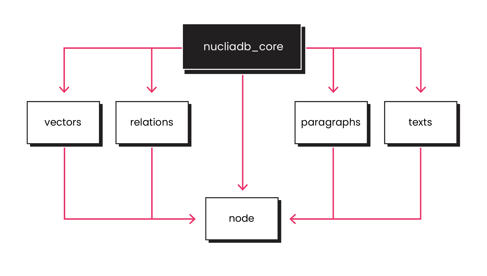

# NucliaDB Node

  

The node is nucliadb's own indexing system, used for storing and retrieving complex AI data like vector embeddings or relations.
Currently the main crates involved in making this system possible are shown in the previous image, along with how they interact with each other.

### nucliadb_core

The node contains four different indexes that need to share certain functionality like error handling, tracing or handling protos types. `nucliadb_core` is the
crate where all this shared dependencies live.

### nucliadb_node

Interacting with nucliadb's four indexes requires going through `nucliadb_node`. This crate provides a grpc interface for adding, removing and searching informacion stored in
the four indexes that live inside the node.

### nucliadb_vectors

Is possible to index vector embeddings using `nucliadb_node` thanks to this crate, nucliadb's own [HNSW](https://arxiv.org/abs/1603.09320) implementaion.

### nucliadb_relations

Is possible to index knowledge graphs using `nucliadb_node` thanks to this crate, nucliadb's own knowledge graph implementation built on top of [heed](https://github.com/meilisearch/heed).

### nucliadb_paragraphs and nucliadb_fields

`nucliadb_node` uses [Tantivy](https://github.com/quickwit-oss/tantivy) to obtain full-text search capabilities, we offer complex querying, BM25 and fuzzy search.
