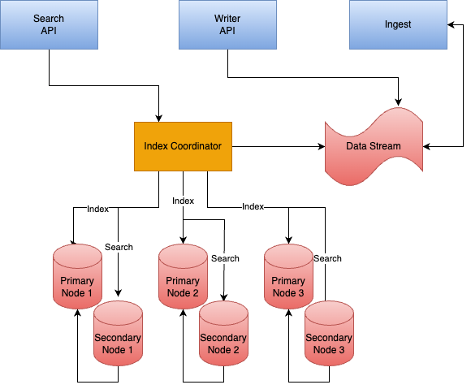

# Sharding and Scaling

This proposal is attempting to synthesize all the ideas around architectural
design for scaling. Most importantly, this proposal details how to leverage
index unification with sharding and shard management strategy to scale NucliaDB
for larger datasets.

This proposal also focuses on an iterative design change for read replication.

## Current solution/situation

Currently, our IndexNode contains our shards. Each shard contains multiple
types of indexes for vector, bm25(with tantivy) and graph capabilities. The implementation
of each index type involves many managed files, threads, etc and can be
quite complex.

Readers and Writers of a shard must be on the same physical machine for a shard.
Right now, that also means a single Kubernetes Pod(part of stateful set).

While we can "rebalance" nodes to some extent, we don't have good metrics
to really know how we should rebalance. Disk size is not a good metric to
know usage of shard.

Moreover, moving a shard is currently tedious. The only implemented option for us
is to reindex a shard on a new node and cutover the reference of the node the shard is on.
Another option could be to copy all the files; however, this is also slow, error prone,
requires locks and places coupling on the ingest component and our IndexNodes.

Overview of current problems:
- IndexNode is managing multiple types of indexes seperately. High overhead.
- CPU tied to disk and difficult to move shards around
- Can not add replicas for an existing KB's shards
- Coupling with shard management and ingest

## Proposed Solution

The proposed solution is oriented around providing a unified index to simplify
how we store shard data on the IndexNode.

With a unified index implementation, it is feasible to provide more
capabilities around sharding(physical read replicas, rebalancing).

### Unified Index

By "unified index," we are referring to an index that stores all data
in a single disk format that hnsw and bm25 index types utilize.

An important aspect of this unified index design is that it also provides
segmented storage. By segmented storage, we mean that each write should
produce a new segment. That new segment will work along with other existing
segments to provide the shard's full dataset.

[more details on the implementation provided elsewhere]

#### Breaking changes

- Split from tantivy: Tantivy is not compatible with this approach.
- No full entity graph implementation built in
- No advanced query support

### Primary / Secondary Node Types

There will be 1 node service that can operate in 2 modes:

- Primary: Responsible for writes and replication
- Secondary: Read only copy of Primary shards. Responsible for servicing search requests.

Both node operation types have the full database implementation. This is in contrast to the
current implementation which has logical and phsyical process boundaries between read
and write paths. This implementation puts an explicit physical boundary on the scalable
read path on the secondary nodes but allows read path in Primary node as well. This allows
us to design an index implementation that does not require file locking between a shared
file system with separate processes.

#### Primary details

Operational details:
- GRPC service
  - Indexing
  - Replication
  - Search
- Designed to allow indexing to multiple shards simultaneously(different than current design)
- Replication:
  - responsible for pushing changes to commit log
  - responsible for facilitating health beat/health checks with secondaries
- StatefulSet(only 1 replica of course), dedicated node pool

Physical properties:
- Persistent disks: start with standard ssd, consider moving to extreme disks if performance is a problem
- CPU: Start with minimum 4 CPU, scale up as needs around concurrent writes/replication increase

#### Secondary details

Operational details:
- GRPC Service
  - Search
  - Should throw error `READ ONLY ERROR` if writes attempted or replication attempted
  - Otherwise, same code base as primary
- Designed to service search requests
- Health check to signal kubernetes traffic should be directed to it
- Kubernetes Deployment + HPA/PDB, dedicated node pool
- Custom instance type with auto provision raided of local ssd disks depending on size requirements

Physical properties:
- local ssd disks: Fast and cheap

### Replication

Each shard will have a commit log to track changes through time,
communicate changes and track replication to secondary node replicas.

- Commit log is append only file which tracks all shard segments
  and their files. This is then used for replication to secondary node replicas.
- Primary nodes are responsible for replicating data to secondary read only nodes consistently
- Each node on the system will have a configured set of physical secondary read only replicas
  at the kubernetes layer that will connect to the primary nodes

### Index coordinator

The Index Coordinator is the component responsible for managing the
IndexNode cluster.

The Index coordinator is the only component that should "know" about
what shards a Knowledge Box has and how to correctly query or write to them.

Responsibilities:
- Know primary health, secondary health(through k8s service)
- Balancing shards across cluster
    - Place new shards appropriately
    - Move shards when things are unbalanced
- Record keeping
    - Shard stats
    - Usage stats
- Index queue consuming, operations
  - Allow writing to multiple shards on a node at a time(right now, we only write to 1 at a time)
- Auto scale based on k8s resource usage

APIs:
- Create Shard
- Delete Shard
- Shard Operation
    - Search
    - etc

#### Ingest changes

Right now, ingest acts as our "Index Coordinator".

The logic for how to store and query Index Nodes are spread throughout multiple components.

This would be moved to the Index Coordinator.

Changes to ingest/etc:
- No longer responsible to directly connecting to primary node GPRC service to create new shards
- No longer responsible for knowing what the best node to create a new shard on

### Index Node Writer

- sync changes of commit log to configured secondary read only copies
- shard create/delete is also part of commit log

#### Disks

Use best performing persistent disks.

Start with standard SSD persistent disks but move to extreme performance disks
if performance required.

### Index Node secondary read only replica

Secondary read only replicas are "dumb" and are mostly only responsible for serving
requests from the replicated state.

#### Disks

To improve secondary read only replica performance, utilize local SSDs

### Overview

Proposal diagram overview:

## Alternatives

### Decouple primary and read only replica shards

Allow shard Primary and secondary read only replicas to be decoupled from one another.

This would be accomplished through complex shard coordination schemes that
allowed management of increasing particular KB shard replicas.

#### Shard state coordination

In order to manage consistency, we would need to use something like raft to
coordinate secondary read only replication state and have secondaries responsible for
their own replication.

The complexity around this is one of the reasons why this proposal focuses
on having the primary responsible for replicating data.

#### Not now

This approach, while interesting, ends up with a lot of moving parts and becomes
quite complex for little value.

The approach outlined in this document allows us an easier path to iterate toward.

## Rollout plan

1. Unified index + commit log implementation
2. Replicate commit log to configured read replicas
3. Index coordinator to coordinate indexing to primary node and query traffic to secondary read replicas

### Key Metrics

- Index consumer latency/lag
- Replication latency/lag
- CPU/Disk on primary/secondary nodes
- Disk IO performance

## Future

- Dynamically configure node read replicas
- Consider moving to Kafka for a more performant ordered message queue