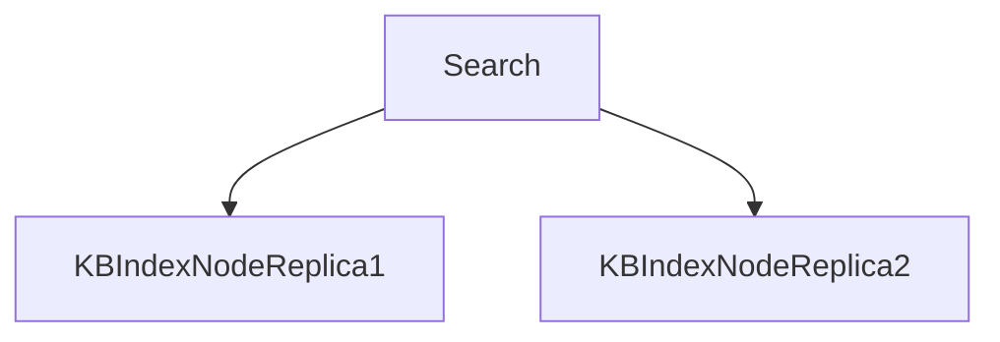
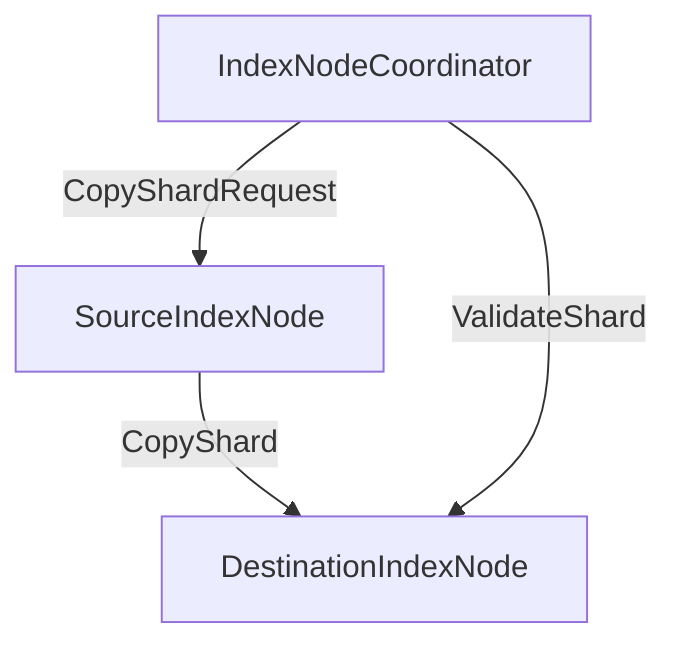
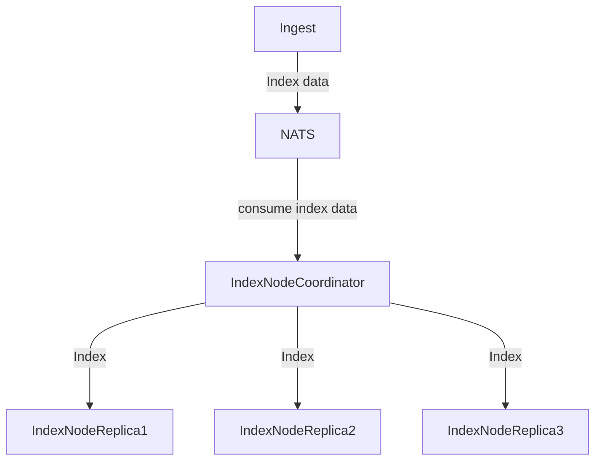
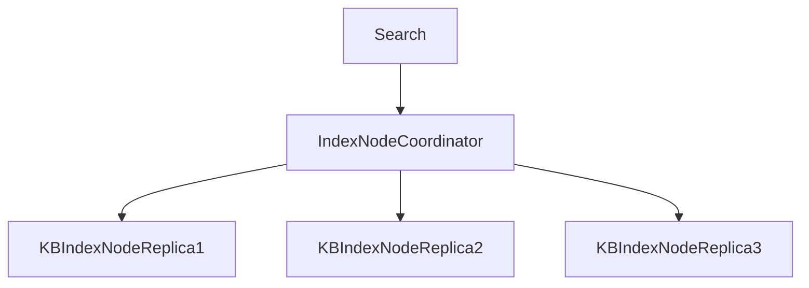

# IndexNode Scaling: Coordinator layer

This proposal focuses on moving the shard replica management, indexing and search load balancing
to a seperate Coordinator layer.

This proposal differs from https://github.com/nuclia/nucliadb/pull/722 in that it keeps all the
same core concepts of the database engine in place while still allowing us to scale.

*Goals*:
- Allow us to dynamically scale to load

*Known cons to approach*
- reads/writes scaling are not decoupled

*Unknowns*
- Long term NucliaDB normal "usage"
- How pricing changes over time affects usage

## Definitions

- Shard: the storage of a knowledge box's indexes(keyword, bm25, graph, vector).
  We currently store multiple replicas of a knowledge box's indexes across different nodes.
- Node: Storage, writer, reader and sidecar(currently) for a set of shards that
  contain index data. This is separate from resource data.
- IndexNode: For the purpose of this proposal and to prevent confusion around naming,
  a Node will be called `IndexNode`
- IndexNodeCoordinator: Layer that manages IndexNode searches, scaling and load balancing

## Current solution/situation

Currently, an IndexNode is deployed for writes(indexing) and reads(searching) for a set
of shards. Each shard is replicated and read(search) requests are typically
round robin load balanced against the IndexNodes that hold replicas.

Scaling this design requires the following:
- indexing replicas needs to be known at write time
- no current way to increase replica count on existing data
- scale disk: physically copy/move shards around between IndexNodes to rebalance
- disk and number of shards per node is the only way to determine a node is "full"
- (number of shards is a poor metric to determine is an IndexNode is full)
- each indexing operation happens on each shard replica a resource is on

Finally, search requests are round robin load balanced against the IndexNodes a knowledge box
shard replicas are located on(2 shard replicas typically) from the search component:

## Proposed Solution

Create a new IndexNodeCoordinator component.

The responsibilies of this component will be:
- Manage IndexNodes and the shard replicas they contain
  - This information will not be managed by ingest anymore and ingest will no longer even need to know about NODES
- Index Consumer: Index data against all shard replicas and validate consistency
- Search proxy: Search requests go to this component, which knows about all
  IndexNodes and which one is best to perform search against
- Increase/descrease replica count by individual shard and move shards around depending on IndexNode load
- Manage shard reindexing / shadow shard implementation 

This proposal focuses on an implementation that will cause minimal impact on the existing
architecture and allows us to test/gather feedback on feasability quickly.

### IndexNode Shard replication:

The IndexNodeCoordinator will ask 1 IndexNode to copy it's shard data to another IndexNode:

When an IndexNode needs it's replicas increased:

- All indexing to shard needs to be buffered
- Reads can only go to existing known good shards

### Indexing:

A single NATS stream will be used for indexing data instead
of the ingest component needing to know about and produce
messages to many streams depending on replica count.

The IndexNodeCoordinator will be responsible for fanning
out writes to replicas.

When fully implemented, ingest will not need to know about
how many replicas a shard has.

### Searches

Search requests will also now go through the IndexNodeCoordinator instead of the `search` component
needing to know about each `IndexNode` and number of replicas.

### IndexNode metrics

An important part of this proposal is to be tracking IndexNode
and replica statistics.

These statistics will be used for determining:
- How shards should be distributed across IndexNodes
- Where new replicas should be placed
- How to rebalance shards
- When to allocate new shards to scale searches

## Rollout plan

### Phase 1: Implement side-by-side

Phase 1 will focus on an approach with limited impact on the existing implementation.

- Existing IndexNodes and architecture will stay in place
- New IndexCoordinator component provided
- New IndexNodes deployed seperately from existing nodes
- Validate indexing, search approach, feature flag for test accounts

### Phase 2: Cutover

Once phase 1 is validated, cut over new scheme.

### Phase 3: Statistics

Focus gathering and exposing metrics around search/write performance for Nodes and Shards on nodes.

We should have APIs(and maybe UIs) to inspect what is going on with the cluster.

### Phase 4: Rebalancing and dynamic scaling

The final phase will be putting the parts together for being able to rebalance shards.

This will allow us to scale if we're read heavy on certain shards as well as scale down underutilized shards.

## Key metrics

- Coordinator search proxy performance
- Index time
- Replica write contention
- Write lag

## Success Criteria

- No downtime rollout and validation
- Dashboards/alarms implemented
- Limited touch scale management
- Key metrics under control

## Open questions

- What is the optimal shard size?
- Will we need chitchat anymore?